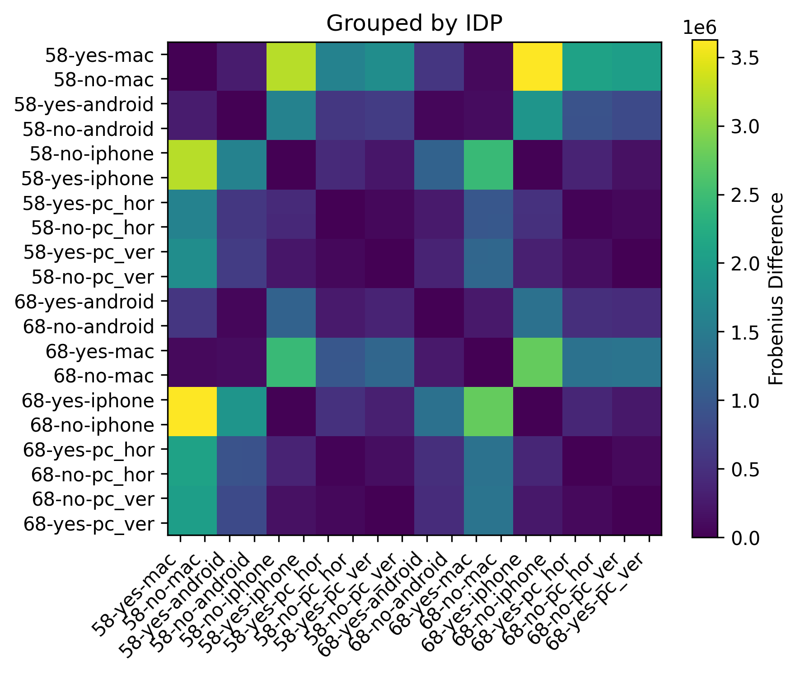
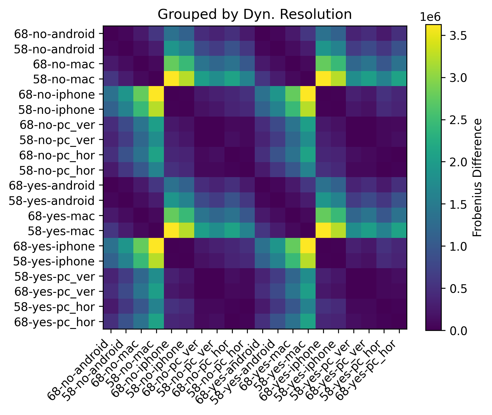
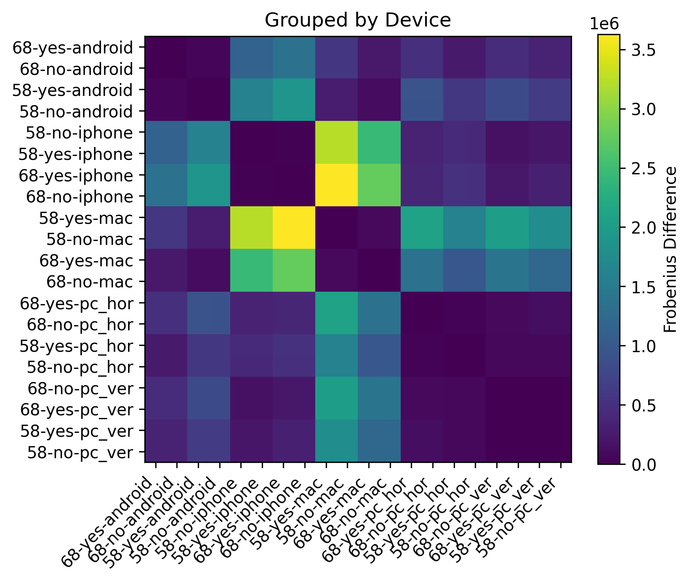

# Analysis & Results

1. [Motivations](#1-motivations)
    1. [Quick Findings](#quick-findings)
2. [Exploration #1: The Effects of Hardware and Software on Generalizability](#2-exploration-1-the-effects-of-hardware-and-software-on-generalizability)
    1. [Analysis Methodology](#2a-analysis-methodology)
        1. [Feature Dimensions](#2ai-feature-dimensions)
        3. [Data Collection](#2aii-data-collection)
        4. [Difference Calculation and Evaluation](#2aiii-difference-calculation-and-evaluation)
    2. [Results](#2b-results)
    3. [Discussion](#2c-discussion)
3. [Exploration #2: Observations of Recording Pipelines](#3-exploration-2-observations-of-recording-pipelines)
    1. [Recording Resolutions and Device Compatibility](#3a-recording-resolutions-and-device-compatibility)
    2. [Rationales Behind OS-Based Differences](#3b-rationales-behind-os-based-differences)
        1. [Rationale #1: Platform-Driven Enforcement](#3bi-rationale-1-platform-driven-enforcement)
        2. [Rationale #2: Downsampling From a "Master" Signal](#3bii-rationale-2-downsampling-from-a-master-signal)

---

<h2 id="1-motivations">1. Motivations</h2>

We aim to better understand the operations of the Meta Quest's [casting](https://www.meta.com/help/quest/192719842695017/) and [recording](www.meta.com/help/quest/516228089650875/?srsltid=AfmBOorVsHW-ZEcP_t_wba_-YTMYAD8uUuCizR4yN9BC4NVCAMcX4h0u) functionality. These operations are crucial for VR-based human subject experimentation for a number of reasons - namely, ensuring that participants navigate virtual tasks correctly and recording virtual events for post-experiment analysis. One powerful affordance of this function is the possibility of computer vision-based analysis of VR events (e.g. object detection and tracking, eye tracking analysis).

However, due to the closed source nature of Meta's head-mounted displays (HMDs), it is difficult to guarantee that any recording operations can be generalizable to different Meta HMDs, across different recording setups. This is potentially troublesome for reproducibility and ease-of-use for researchers who rely on vision-based analysis of VR events.

This project therefore aims to shed light on this obscure but crucial function provided by the Meta ecosystem. Though the results and insights gained from this analysis may be generalized to different HMD devices and ecosystems (e.g. the HTC Vive series), we emphasize that a significant part of this report is isolated to idiosyncracies pertaining to the Meta ecosystem.

<h4 id="quick-findings">Quick Findings</h4>

- Meta devices cannot simultaneously **screencast** and **record video**. 
    - To initialize recording, you must record from the device viewing the screencast.
    - Mobile devices (iPhones, Androids) are optimal for recording, as the _Meta Horizon App_ ([iOS](https://apps.apple.com/us/app/meta-horizon/id1366478176), [Android](https://play.google.com/store/apps/details?id=com.oculus.twilight&hl=en_US)) comes with in-house recording functions in the app itself.
    - Meta's screen-casting function casts the screen from the **left eye**.
- A mapping operation from VR screen space to video space is possible, but has caveats.
    - Recordings do not differ based on the **dynamic resolution** setting in Unity. 
    - Adjusting the **IPD** produces slightly different recorddings, but the same mapping function is technically interchangeable if in a pinch.
    - **Device type** (e.g. Mac, Windows, iPhone, Android) are the most distinct causes of differences between recordings. Mapping operations MUST be re-calculated depending on recording device type.
    - Video recordings **do not necessarily align with frames from VR**. A different methodology is needed to connect video frames with Unity frames.

---

<h2 id="2-exploration-1-the-effects-of-hardware-and-software-on-generalizability">2. Exploration #1: The Effects of Hardware and Software on Generalizability</h2>

In this first exploration, we aim to identify differences in recording quality between different common recording setups. There are in fact multiple ways to record video of VR events, such as using Meta's in-built Camera system or using an external application such as [scrcpy](https://github.com/genymobile/scrcpy). Further, there are sveral recording (and casting) settings exposed to the user that impact the quality of these recordings (e.g. aspect ratio, the bitrate of recording/casting). In other words, differences between recording setups can be quantified by 1) differences in software settings, and 2) differences in recording methods. 

These particular differences are unique to the Meta Quest ecosystem and Unity XR subsystems, the former of which is currently closed source and subject to frequent software updates. This makes it rather difficult to guarantee that the recording setups described in [our "methodology" description](methodology.md) can be transferrable between different use cases. This poses a problem for reproducibility and consistency for any research project that requires video recordings of VR events - especially those that involve computer vision-based analysis such as object detection.

We utilize permutation-based model testing to explore a key question: **do the three factors explored here (IPD, activation of dynamic resolution, and the recording device) explain the structures and patterns in distance matrices between different recording setups better than random labeling?** This exploration is implemented via a permutation test, which affords us to assets statistical significance without assuming a specific parametric model.

<h4 id="2a-analysis-methodology">2a. Analysis Methodology</h4>

We tested the following dimensions on a [Meta Quest 2](https://www.meta.com/quest/products/quest-2/), which features only three IPD levels but was one of the most popular devices at a price point of $300 during the COVID-19 pandemic. This test could, in theory, be replicated on a Meta Quest Pro or 3 but it is implicitly understood that the VR head-mounted display (HMD) will be an obvious factor in this. For our researcher's sanity, we isolated this experiment to just the Meta Quest 2.

The recording process is detailed in [our "methodology" description](methodology.md) already and will not be re-iterated here. Note that the the calibration target arrangement differs between that used in this analysis and its current iteration, but the underlying programming and post-processing are otherwise identical.

<h5 id="2ai-feature-dimensions">2ai. Feature Dimensions</h5>

We were primarily interested in which of these affect what is shown on screencast:

- **IPD**: (58 vs. 63 vs. 68)
- **Screen Cast Device & Applications**:
    - Android w/ Meta Horizon App
    - iPhone w/ Meta Horizon App
    - Mac w/ QuickTime Player
    - PC w/ Horizontal Monitor & OBS
    - PC w/ Vertical Monitor & OBS
- **Dynamic Resolution in Unity**: Off vs. On

Conditions that remained static across all conditions are:

- **Bitrate**: The bitrate of the recording and casting (3 Mbps)
- **Eye Reference**: All recordings were anchored at the left eye perspective.
- **Aspect ratio**: All recordings and casting was done in Landscape mode (16:9)
- **HMD deviec**: A single Meta Quest 2 was used.

<h5 id="2aii-data-collection">2aii. Data Collection</h5>

|Display Device|Resolution|Recording Methodology|
|:-|:-|:-|
|PC w/ Horizontal Monitor|`2560px` x `1080px`|Web Casting ([www.oculus.com/casting](www.oculus.com/casting)) + OBS|
|PC w/ Vertical Monitor|`1080px` x `1920px`|Web Casting ([www.oculus.com/casting](www.oculus.com/casting)) + OBS|
|Mac M1 Pro|`1512px` x `982px`|Web Casting ([www.oculus.com/casting](www.oculus.com/casting)) + QuickTime Player|
|iPhone XR|`1792px` x `828px`|[Meta Horizon App](https://apps.apple.com/us/app/meta-horizon/id1366478176), comes with a built-in recording feature|
|Motorola Razr Plus 2024|`2640px` x `1080px`|[Meta Horizon App](https://play.google.com/store/apps/details?id=com.oculus.twilight&hl=en_US), comes with a built-in recording feature|

Data collection features a calibration session and accompanying video recording across different hardware and software conditions. We took advantage of Meta's in-built screen-casting feature to accomplish this, which visualizes what the VR user is seeing from the perspective of the left eye. This video recording is not inherently in alignment with the screen space of the virtual cameras in Unity, thus requiring an unknown projection matrix to convert from screen to video space. Nonetheless, each video recording captures the calibration target as well as the frame counter in the top-left. In post-process analysis, template matching was used to identify the positions of each calibration target relative to the video frame; these positions would be relative to the top-left pixel of the video capture.

The steps for data collection are as follows:

1. When opening the calibration stage, the screen-cast to either "Mobile" (for Android and iPhone) or "Web" (for PC or Mac). The video recording is started promptly.
2. The calibrabration stage starts. The video continues to record until the calibration phase ends.
3. The outputted `.csv` and `.mp4`/`.mov` are aggregated for post-analysis.
4. Steps 1-3 are replicated across multiple IPD settings, Dynamic Rendering toggling, and recording devices.

All data collected for this analysis is sourced online [here](https://nyu.box.com/s/1gr9u1pw2twd3krbo60bin7m2yqat2pe) under `analysis/data/`. Please make sure to read our [notes on templates and datasets](templates_and_datasets.md) prior to downloading this dataset. 

<h5 id="2aiii-difference-calculation-and-evaluation">2aiii. Difference Calculation and Evaluation</h5>

One of the simpler ways to derive the differences across the various conditions is to measure the differences in the estimated transformation matrices in of themselves. In an ideal situation where two conditions are identical, their transformation matrices should be similar, if not identical. Thus, measuring differences in their transformation matrices is suitable. We quantify that difference through two methods: 1) pair-wise Frobenius Distance of transformation matrices between each possible pair of conditions, and 2) the Squared Frobenius Distance of transformation matrices across each possible pair of conditions.

Let $\{A_1, A_2, \ldots, A_n\}$ be the set of transformation matrices, where each $A_i \in \mathbb{R}^{m \times k}.$  We define the Frobenius Distance matrix $D \in \mathbb{R}^{n \times n}$ as:

$$
D_{ij} = \| A_i - A_j \|_F = \sqrt{\sum_{p=1}^{m} \sum_{q=1}^{k} (A_{i,pq} - A_{j,pq})^2 }
$$

Alternatively, we define the Squared Frobenius Distance matrix as:

$$
D_{ij} = \| A_i - A_j \|_F^2 = \sum_{p=1}^{m} \sum_{q=1}^{k} (A_{i,pq} - A_{j,pq})^2
$$

There are, naturally, some issues with this approach. Firstly, we need to recognize that any operations that involve float-point precision such as `numpy.linalg.lstsq` may suffer very miniscule imprecisions that coalesce over time. Furthermore, there may always be the potential of ill-ranked matrices, null values, etc. We are fortunate that we need a relatively simple solution given that we are only measuring 2D coordinates. Finally, we recognize that the Frobenius Distance operation simplifies the comparison down to 1D values as opposed to a fuller analysis with 2D semantic structures. Nonetheless, we still believe there is value in utilizing the Frobenius Distance and Squared Frobenius Distance as rough measurements of differences between transformation matrices.

Post-distance matrix calculation, our analysis shifts to focus on the relative impact of each feature on the differences between estimated transformation matrices. To do so, we frame the problem as a contrast between _between-group_ and _within-group_ distances for each feature:

- "Between-group distances" refer to distances between recordings that differ under a single factor change (e.g. different IPD while keeping recording device and dynamic resolution consistent).
- "Within-group distances" refer to  distances between recordings that maintain consistent with a single factor but differ with the other two factors (e.g. the same IPD but different recording device or dynamic resolution setting).

The resulting test statistic is defined as the difference between the mean between-group distance and the mean within-group distance. Statistical significance is assessed by comparing the observed statistic to a null distribution generated by randomly permuting feature labels. Rather importantly, our approach here evaluates whether a given feature induces a consistent, separable structure in the distance matrices observed.

We make no assumption of statistical independence between IPD, dynamic resolution, and recording device. While these features may be causally independent due to system design (e.g. adjusting IPD doesn't affect the device used to record video), there may still be confounding effects on the resulting transformation matrices.

<h4 id="2b-results">2b. Results</h4>

To best represent the pair-wise analysis, we've generated three diferent **distance heatmaps clustered across our select features**. Darker colors correlate to smaller differences, while lighter colors represent greater differences. The naming structure of each column and row defines `<IPD>-<DYN. RES>-<DEVICE>`.

These heatmaps allow us to derive the following intuitions based purely from visual analysis:

- Changing between dynamic resolution does NOT affect recording, so no need for a new transformation matrix
- Changing the IPD produces a minor change in transformation matrix, so a re-calculation is needed. However, in a punch, it may be okay to use the same transforamtion matrix.
- Switching recording devices DOES require a different transformation matrix

The resulting distance matrix for IPD was subject to a permutation test for statistic significance across transformation matrix differences. The results of this are depicted in the table below. Note that in this analysis:

$$
T = \text{mean}(\text{between}) - \text{mean}(\text{within})
$$

- $T \gt 0$: groups are more different than similar; signal that the explored feature separates the transformation matrices.
- $T \approx 0$: No structure implied
- $T \lt 0$: Within-group distances are _larger_ than between-group distances; there is likely no meaningful grouping)

|Feature|T|p-value|
|:-|:-|:-|
|IPD|`-48371.9690`|`0.69330`|
|Dynamic Resolution|`-89759.5784`|`0.16580`|
|Recording Device|`974227.2139`|`0.00000`|

Permutation modeling reveals the following key insights:

1. The **recording device** depicts a strong, unambiguous, and statistically significant result. The recording device clearly drives differences between transformation matrices.
2. The toggling of **dynamic resolution** in Unity indicates that within-group distances are larger than between-group distances; the p-value is not signifiant. The negative T-value (`-89759.5784`) implies that there are no consistent groupings.
3. The **IPD** has a very small, negative effect but is non-significant. This implies that the IPD does not have a strong effect on transformation matrix differences.

<h4 id="2c-discussion">2c. Discussion</h4>

The first result to immediately pay attention to is a seemingly disparate outcome between the visual observation of heatmap differences and permutation model results for IPD. Visual analysis implies that IPD plays a small role in differences, whereas permutation modeling indicates no significant impact of IPD on differences. We take this as a signal that adjusting the IPD may change transformation matrices slightly, but not in a consistent and group-separating way. Consequently, though it is ideal to re-calculate a transformation matrix of the IPD is adjusted, you are likely to be safe using another transformation matrix derived from an IPD relatively close to your target IPD.

Otherwise, results between visual observation and permutation modeling align for dynamic resolution and recording device choice. Simply put, it is safe to adjust the dynamic resolution toggle in Unity without needing to re-calculate a new transformation matrix; if a different recording device is used, then it is a good idea to re-calculate the transformation matrix for that new device. 

The observed characteristic of the recording device impacting transformation matrices, in hindsight, makes perfect sense: for any kind of transformation from one space to another, adjustments to either the input or output spaces' dimensionality necessitate an adjustment to the transformation between these spaces. In this case, the adjustment observed is the resolution of the output video. While all videos attempt to maintain a `16:9` aspect ratio (with the only differences between PC-based recordings via OBS) their resolutions are otherwise different.

---

<h2 id="3-exploration-2-observations-of-recording-pipelines">3. Exploration #2: Observations of Recording Pipelines</h2>

This section is less of a rigorous academic hypothesis test, but rather a collection of observations and assumptions made of the Meta ecosystems' recording and casting operations. These observations are purely driven by the fact that Meta's operating systems on their HMDs are _closed source_.

<h4 id="3a-recording-resolutions-and-device-compatibility">3a. Recording Resolutions and Device Compatibility</h4>

When generating templates for the Meta Quest Pro, we observed the following differences between video resolutions based on recording device. This is a natural extension of the findings in [Exploration #1](#2-exploration-1-the-effects-of-hardware-and-software-on-generalizability), where we discovered that reording device played a massive effect on differences between transformation matrices.

> _**Note:** All recordings are conducted from the Left Eye and are set to Landscape mode (16:9 aspect ratio)._ 

|Casting Device|OS|Display Resolution|Recording Resolution|
|:-|:-|:-:|:-:|
|Meta Quest Pro (v2.1.1033)|Android|`1800` x `1920` (per eye)|`1920` x `1080`|
|Motorola Razr+ 2024|Android|`2640` x `1080`|`2640` x `1472`|
|Moto G 64Gb - 2025|Android|`1604` x `720`|`1600` x `896`|
|iPhone Xr|iOS|`1792` x `828`|`1280` x `720`|
|iPad Pro 11in 2nd-Gen|iPad OS|`2388` x `1668`|`1280` x `720`|

Rules appear to apply differently between iOS/iPad OS and Android.

- **Android**-based devices appear to try their best to match the width of the display, and then pad the height to match the goal 16:9 aspect ratio. 
    - It is likely that the output width is rounded to match multiples of 16, given the small adjustment observed with the "Moto G 64Gb - 2025" model from `1604`px to `1600`px... though this specificity has yet to be tested.
- The **Apple ecosystem** (iOS, iPadOS) appears to force a standardized video resolution of `720p`
    - Both iPhone XR and iPad recordings output to `1280` x `720` regardless of display resolution.

<h4 id="3b-rationales-behind-os-based-differences">3b. Rationales Behind OS-Based Differences</h4>

<h5 id="3bi-rationale-1-platform-driven-enforcement">3bi. Rationale #1: Platform-Driven Enforcement</h5>

One potential reason for these differences across OS types may be **platform-driven enforcement**.

- Android might be more flexible in general (more encoders, flexible permissions).
- The Apple ecosystem may enforce stricter encoding pipelines ([ReplayKit](https://developer.apple.com/documentation/ReplayKit), [AVFoundation](https://developer.apple.com/documentation/avfoundation/)).

<h5 id="3bii-rationale-2-downsampling-from-a-master-signal">3bii. Rationale #2: Downsampling From a "Master" Signal</h5>

The Meta Quest Pro has a per-eye resolution of `1800` x `1920`. In fact, if you use an application like [scrcpy](https://github.com/genymobile/scrcpy) to capture the raw footage from the Android foundation that the Meta Quest systems are built on top of, you'll notice that the raw footage is actually projected and distorted to conform better to lens ergonomics. What the user sees in the display is the result of a projected display, in other words; there's a lot going on under the hood.

