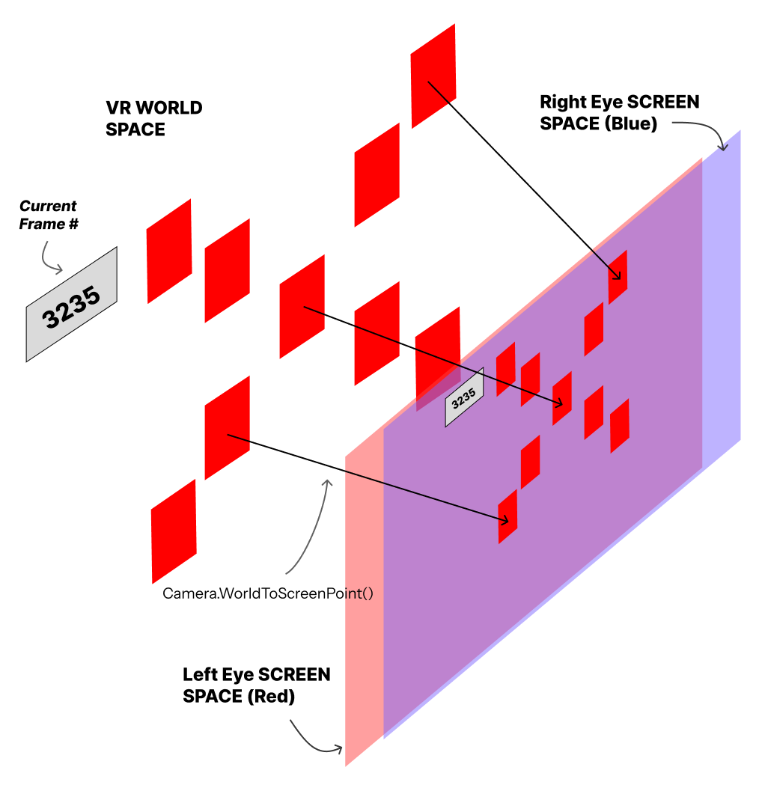
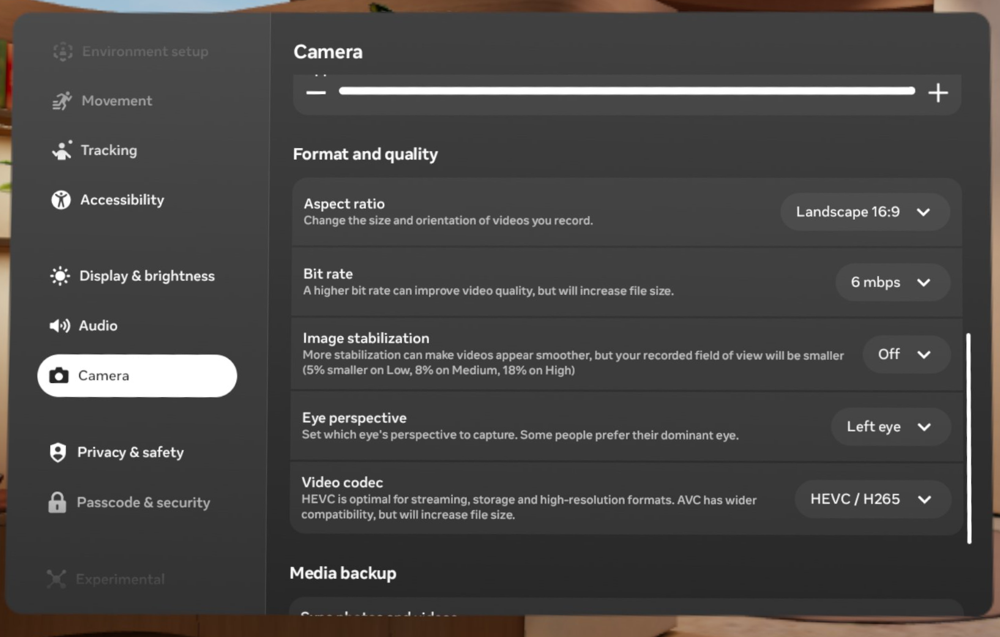

# Methodology

This document is split into the following:

1. [Data Collection: `Unity/`](#1-data-collection) - Basic overview of how we aggregate calibration data from Unity.
    1. [Implementation Details](#1a-implementation-details) - How the 9-point calibration scheme works and how to run it on your Meta device.
    2. [World-to-Screen Projection](#1b-world-to-screen-projection) - The specifics of how world targets are converted to screen space.
    3. [Video Recording](#1c-video-recording) - General recommendations for how to record video of the calibration process.
2. [Post-Process Calibration](#2-post-process-calibration) - How the Python code works.
    1. [Calibration](#2a-calibration) - How calibration and subsequent transformation matrix is calculated.
    2. [Transformations](#2b-transformations) - How the transformation matrix from 2A are applied.

---

<h2 id="1-data-collection">Data Collection: <code>Unity/</code></h2>

<h4 id="1a-implementation-details">1a. Implementation Details</h4>

<figure style="width:50%;max-width:500px;margin-left:auto;margin-right:auto;">

<figcaption>Example of a data calibration session where points in VR World Space are projected onto the Screen Space (i.e. the Camera Space). An additional projection is required for projecting those screen points onto the Video Space (i.e. the video recording); such a projection does not have any immediate solution.</figcaption>
</figure>

A 9-point calibration scheme was engineered in Unity. This Unity instance is a bare minimum environment with no landmarks, backgrounds, or other visual features. The 9-point calibration scheme is attached to the user’s head in the virtual world, always staying in front of and moving relative to the head. This 9-point scheme features three layers, starting with the center target, a middle 4-target circle, and an outer 4-target circle. Additionally, a frame counter is added in the periphery of this interface as a means of tracking in the video recording what Unity frame was currently being seen in the video. Having the current frame counter visible is important for data alignment in post-processing.

To access the Unity instance, there are two primary ways:

1. Build the Unity project manually via Unity. All relevant project files are provided in the `Unity/` directory.
2. Side-load the `SVM.apk`, which are provided within the available [Releases](https://github.com/SimpleDevs-Research/Unity-ScreenSpace-VideoSpace-Map/releases). It is generally recommended to download the latest release version.

<h4 id="1b-world-to-screen-projection">1b. World-to-Screen Projection</h4>

When a calibration target appears, a world-to-screen projection is calculated and recorded in a `.csv` dataframe file.

- Each calibration target appears for three seconds only and one at a time. This sequence starts with the center target and moves outward to the middle target layer, then the outer target layer. 
    - Within each layer, targets are rendered in a counter-clockwise pattern starting from the top-right target.
    - The order of target appearances is hard-programmed in its current state, but there is no explicit rule for this ordering. 
- The World-to-Screen projection converts a calibration target's position in 3D World Space to the frame dimensions of two virtual cameras, each representing the "eyes" of the user. 
    - The resulting projection is a 3-dimensional coordinate where the X and Y coordinates are relative to the bottom-left corner of a virtual camera's view frustrum while the Z-position is the distance of that point to the screen. 
    - This projection opeation is in-built into Unity and is accessed as `Camera.WorldToScreenPoint(Vector3 position)`.
    - As the current implementation uses two cameras for each eye, two screen space coordinates - one for the left eye, another for the right eye - are recorded.

<figure style="width:50%;max-width:500px;margin-left:auto;margin-right:auto">+

<figcaption>Run-through of the calibration step, with calibration targets appearing and disappearing one at a time. This is an older arrangement of calibration targets, but the inherent logic remains identical.</figcaption>
</figure>

<h4 id="1c-video-recording">1c. Video Recording</h4>

While the calibration step is ongoing, the user's display must be recorded as a video. There are several ways to record this video, but an important feature is that the frame counter in the top-left is at least visible. We provide some accessible ways to record videos in the following table.

|Recording Method|Provided in-house by Meta|Notes|
|:-|:-|:-|
|Meta Quest device's in-built recording system|Yes*|Acquiring the footage is tedious; synchronizing videos from the HMD device to a local computer does not migrate certain metadata (i.e. the video creation date)|
|Meta Horizon Casting|Yes*|Fallible to network distruptions; characteristics of the casting device (e.g. OS type, display resolution) impacts video quality|
|[scrcpy](https://github.com/genymobile/scrcpy)|No|Video is barrel-distorted and must be corrected prior to analysis; Some Meta devices (e.g. the Meta Quest Pro) produce videos with visual artifacts or missing frames|

<figure style="max-width:600px;margin-left:auto;margin-right:auto;">

<figcaption><em>*Note</em>:  When using one of Meta's in-built recording systems, be aware of the provided Camera settings. This screenshot depicts the recording settings used by the researchers during this exploration.</figcaption>
</figure>

---

<h2 id="2-post-process-analysis">2. Post-Process Calibration</h2>

> For further information on how to _execute_ the Python scripts, please refer to [our Python documentation](python.md) explicitly. this section only covers the logical operations behind the code.

<h4 id="2a-calibration">2a. Calibration</h4>

1. **Frame Number Extraction**: Identify key frames from the video associated with each isolated calibration target. This involves:
    1. frame-cropping to extract the specific region of interest in the video where the frame counter is visible.
    2. Grayscale-ing and Binary Thresholding each region of interest
    3. Applying Optical Character Recognition (OCR) to read the frame count from the thresholded region of interest.
2. **Template Matching**: Mapping the frame with the appearance of each calibration target, extracting at least one frame per target. This involves:
    1. Upon successful frame number extraction, we compare each frame to the VR frame timestamps of each calibration target.
    2. Once a calibration target is mapped to a frame, the calibration target - frame pair is cached.
    3. For each target - frame pair, **template matching** is used to identify the centroid coordinates of each calibration target as they appear in the video. The screen space coordinates and estimated video space coordinates of each calibration target are cached for later.
3. **Least-Squares Solution to Linear Matrix Mapping**: Across all screen - video coordinate pairs of the calibration session, the transformation matrix to calculate the projection mapping from screen space to video space is conducted using least-squares (see [np.linalg.lstsq](https://numpy.org/doc/stable/reference/generated/numpy.linalg.lstsq.html)).
4. **Validation**: Once the transformation matrix is estimated, a validation step is conducted where each calibration target's video space coordinates are estimated using the transformatio matrix.

<figure style="width:50%;max-width:500px;margin-left:auto;margin-right:auto">

<figcaption>Example of an extracted frame associated with the 4th calibration target. The light-blue diamond marker is the position of the calibration target in the video, derived from template matching. The light-blue orthogonal cross in the white void is the raw screen space coordinates of the actual calibration target recorded from VR. Finally, the black cross represents the estimated position of the calibration target, transformed from screen space to video space. The fact that the black cross overlaps the light-blue diamond means that the transformation matrix correctly projects screen-space coordinates.</figcaption>
</figure>

<h4 id="2b-transformations">2b. Transformations</h4>

The `Unity/` build provided with this repository has another scene that is used for further estimation and validation of the derived transformation matrix. To accomplish this, simply start and stop a video recording once the "Cube" scene is additively loaded into the "Base" scene - this can be toggled by pressing the "A" button on Meta Quest controllers. The scene is auto-set to record the position of a floating cube in front of the VR user, so nothing else needs to be toggled by the VR user.

<figure style="width:100%;max-width:500px;margin-left:auto;margin-right:auto">

<figcaption>A scene with a blue cube and dark background is provided for debugging and further validation of the derived transformation matrix from calibration.</figcaption>
</figure>

<figure style="width:100%;max-width:500px;margin-left:auto;margin-right:auto">

<figcaption>The same scene with the blue cube and its screen space position, transformed to video space through a transformation matrix projection. The light-blue cross represents the cube's anchor position in VR space as video coordinates.</figcaption>
</figure>

The `src/transform.py` handles all operations with estimating the positions of GameObjects in a video. The general steps that this script conducts are:

1. **Frame Number Extraction**: Similar to the same step in Post-Processing Analysis, a series of ROI extraction, grayscaling, thresholding, and OCR-ing are done to extract the VR frame number from each video frame.
2. **Frame - GameObject Mapping**: For each frame, identify any GameObjects that were visible in that frame. This is done by cross-referencing the extracted frame number from a `.csv` file outputted by the VR simulation - in this case, the blue cube's position data in screen space.
3. **Projection via Transformation Matrix**: Apply projections for each frame's blue cube into video space.
4. Re-render the video with the re-calculated video space coordinates of each GameObject, for visual inspection.