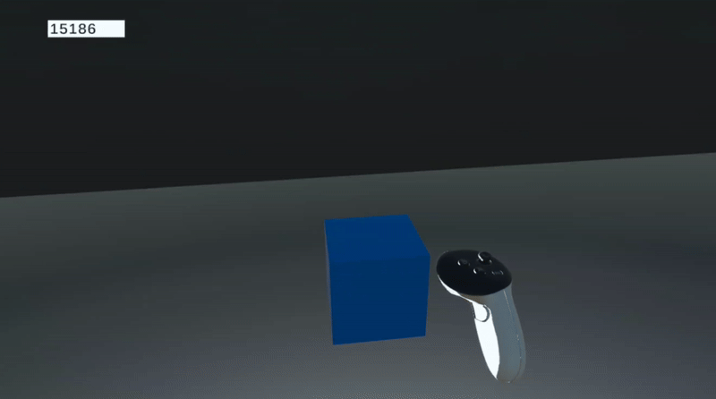
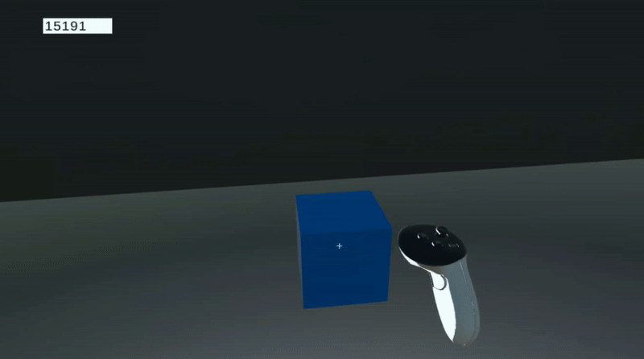

# Python Instructions

All operations are subsequently performed in Python; the relevant scripts are maintained within the `src/` directory.

1. [Virtual Environment Generation](#1-virtual-environment-generation) - How to get a Python environment running for the post-process code.
    1. [Instantiating and running a new Python environment](#1a-environment)
    2. [Package Installation](#1b-requirements)
2. [Relevant Python Scripts](#2-scripts) - How the Python code works and how to run it for yourself.
    1. [Calibration](#2a-calibration) - Calculate the transformation matrix from screen to video space.
    2. [Transformation from Screen to Video Space](#2b-transformation-from-screen-to-video-space) - Apply the transformation to screen position coordinates.
    3. [Labeling Videos with Transformed Coordinates](#2c-labeling-videos) - Annotate a session recorded separately from the calibration session.
    4. [Rescaling from one Video Space to Another](#2d-rescaling-from-one-video-space-to-another) - If needing to match from one recording setup to another.
3. [Accessing Templates](#3-accessing-templates) - If you need access to some pre-existing templates for your own use case, look here.
4. [Analysis Python Notebook](#4-analysis-python-notebook) - Legacy code + pipeline for hardware generalizability analysis

> For further information on the _logical operations behind the code_, please refer to [our Methodology documentation](methodology.md). This section only covers how to execute/run the relevant Python scripts.

<h2 id="1-virtual-environment-generation">1. Virtual Environment Generation</h2>

We highly recommend that you initialize and run all operations within a virtual environment. This prevents mutation of your global settings on your device. Here are generalized instructions to create a Python virtual environment:

<h4 id="1a-environment">1a. Create and run a new python environment</h4>

```bash
python -m venv .venv

source .venv/bin/activate   # OS X, Linux
.venv/Scripts/activate      # Windows
```

<h4 id="1b-requirements">1b. Package Installation</h4>

```bash
pip install -r requirements.txt
```

---

<h2 id="2-scripts">2. Relevant Python Scripts</h2>

<h4 id="2a-calibration">2a. Calibration</h4>

Provided a video sequence with calibration targets and a table of known calibration targets within VR screen space, `src/calibrate.py` calculates the transformation matrix from screen to video space.

To accomplish this step, you will need three files:

1. The `calibration.csv` file outputted by the Unity instance after running through a calibration sequence.
2. The recorded footage as an `.mp4` file.
3. A reference image for what the anchor looks like. The reference image used in our `Unity` build is `src/anchor.png`.

Calibration is run by the `src/calibrate.py` script, which you can call via the command line:

```bash
python src/calibrate.py [-h] [-sb START_BUFFER] [-vf VIDEO_FILENAME] [-tf TARGETS_FILENAME] root_dir name

positional arguments:
  root_dir              Relative directory to your calibration trial
  calibration_name      Calibration name, which will be used as the filename of the outputted calibration file

options:
  -h, --help            show this help message and exit
  -ap ANCHOR_FILEPATH, --anchor_filepath ANCHOR_FILEPATH
                        Path to a reference image for the calibration targets used in the Unity scene. [Default='./src/anchor.png']
  -vf VIDEO_FILENAME, --video_filename VIDEO_FILENAME
                        Fileame of the video file, including extension, relative to the calibration trial dir [Default = 'calibration.mp4']
  -tf TARGETS_FILENAME, --targets_filename TARGETS_FILENAME
                        Filename of the targets csv file, including extension, relative to the calibration trial dir [Default = 'calibration.csv']
  -xc X_COLNAME, --x_colname X_COLNAME
                        The column name in target file corresponding to the x-coordinate of each target's screen position. [Default='left_screen_pos_x']
  -yc Y_COLNAME, --y_colname Y_COLNAME
                        The column name in target file corresponding to the y-coordinate of each target's screen position. [Default='left_screen_pos_y']
  -sb START_BUFFER, --start_buffer START_BUFFER
                        Buffer time (in seconds) from the video start where we should start processing the video [Default = 0]
  --duration DURATION   In seconds, how long from the start defined by 'start_buffer' should we consider the calibration session to be? [Default=35.0]
  --validate            Should we validate the transformation matrix's accuracy?
  --verbose             Print out messages to indicate progress.
```

You can still invoke the core functionality of this script via an `import` and call to `calibrate()`:

```python
# How you can import the function for your own usage:
from src.calibrate import calibrate

# Function name and arguments.
# `calibrate()` considers the `start_buffer_ms` and `duration_ms` arguments as **milliseconds**, not in seconds!
# This is a noteworthy difference from running the function via the the command line.
calibrate(
    root_dir:str, 
    calibration_name:str,
    anchor_filepath:str='./src/anchor.png',
    video_filename:str="calibration.mp4", 
    targets_filename:str="calibration.csv",
    x_colname:str="left_screen_pos_x",
    y_colname:str="left_screen_pos_y",
    start_buffer_ms:int=0,
    duration_ms:int=35000,
    validate:bool=True,
    verbose:bool=True    
)
```

<h4 id="2b-transformation-from-screen-to-video-space">2b. Transformation from Screen to Video Space</h4>

Given a transformation matrix calculated using `calibrate.py` (or by using one of our pre-calculated templates) and the screen space positions of one or more objects that need to be transformed, then this script effectively transforms those coordinates into video space.

To accomplish this step, you will need two files:

1. A transformation template file, i.e. a `.json` file outputted by either `src/calibrate.py` or downloaded from our existing repository of templates.
2. A `.csv` file containing screen space positions that need to be converted into video space. Each axis coordinate must be its own column.

Transformations can be run by the `src/transform.py` script, which you can call via the command line:

```bash
python src/transform.py [-h] [-fc FRAME_COLNAME] [-xc X_COLNAME] [-yc Y_COLNAME] [-nxc NEW_X_COLNAME] [-nyc NEW_Y_COLNAME] [-od OUTPUT_DIRNAME] calibration_filepath positions_filepath

positional arguments:
  calibration_filepath  Path to either the Transformer or Calibration `.json` file
  positions_filepath    Path to the the positions `.csv` file

options:
  -h, --help            show this help message and exit
  -fc FRAME_COLNAME, --frame_colname FRAME_COLNAME
                        The column name in your positions file corresponding to the frame number
  -xc X_COLNAME, --x_colname X_COLNAME
                        The column name in your positions file corresponding to the X coordinate in screen space
  -yc Y_COLNAME, --y_colname Y_COLNAME
                        The column name in your positions file corresponding to the Y coordinate in screen space
  -nxc NEW_X_COLNAME, --new_x_colname NEW_X_COLNAME
                        The NEW column name of the re-calibrated x-coord. If an empty string, it will default to `x_colname`
  -nyc NEW_Y_COLNAME, --new_y_colname NEW_Y_COLNAME
                        The NEW column name of the re-calibrated y-coord. If an empty string, it will default to `y_colname`
  -od OUTPUT_DIRNAME, --output_dirname OUTPUT_DIRNAME
                        Output directory relative to directory of either the positions filepath or video filepath; a new folder will be generated in the same location as your position/video file
```

You can still invoke the core functionality of this script via an `import` and call to `transform_screen_positions()`:

```python
# How you can import the function for your own usage:
from src.transform import transform_screen_positions

# Function name and arguments.
transform_screen_positions(
    calibration_filepath:str,
    positions_filepath:str,
    frame_colname:str='frame',
    x_colname:str='left_screen_pos_x',
    y_colname:str='left_screen_pos_y',
    new_x_colname:str="video_x",
    new_y_colname:str="video_y",
    output_dirname:str='estimations',
)
```

<h4 id="2c-labeling-videos">2c. Labeling Videos</h4>

<div style="display: grid; grid-template-columns: 1fr 1fr; gap: 16px;">
<div>
<figure style="width:100%;max-width:500px;margin-left:auto;margin-right:auto">

<figcaption>A scene with a blue cube and dark background is provided for debugging and further validation of the derived transformation matrix from calibration.</figcaption>
</figure>
</div>
<div>
<figure style="width:100%;max-width:500px;margin-left:auto;margin-right:auto">

<figcaption>The same scene with the blue cube and its screen space position, transformed to video space through a transformation matrix projection. The light-blue cross represents the cube's anchor position in VR space as video coordinates.</figcaption>
</figure>
</div>
</div>

If you have a recording of screen positions (as an `.mp4` file) and the transformed positions of objects shown in that video (as a `.csv` file), then this script produces a re-labeled video. There is no guarantee that the outputted video will be at the same sample rate as the original video.

To accomplish this step, you will need two files:

1. An `.mp4` video recording of a session that contains objects that need to be converted from screen space to video space.
2. A `.csv` file containing _transformed_ positions of objects depicted in the video recording. 

Video labeling can be run by the `src/video.py` script, which you can call via the command line:

```bash
python src/video.py [-h] [-od OUTPUT_DIRNAME] [-sb START_BUFFER] [-fc FRAME_COLNAME] [-xc X_COLNAME] [-yc Y_COLNAME] [-p] [--verbose] video_filepath positions_filepath

positional arguments:
  video_filepath        Filepath to the video file you want to label.
  positions_filepath    File path to the `.csv` file containing coordinates to map to the provided video. Should already be transformed to match video dimensions.

options:
  -h, --help            show this help message and exit
  -od OUTPUT_DIRNAME, --output_dirname OUTPUT_DIRNAME
                        Output directory relative to directory of either the positions filepath or video filepath; a new folder will be generated in the same location as your position/video file
  -sb START_BUFFER, --start_buffer START_BUFFER
                        Buffer time (in seconds) from the video start where we should start processing the video
  -fc FRAME_COLNAME, --frame_colname FRAME_COLNAME
                        The column name in your positions file corresponding to the frame number
  -xc X_COLNAME, --x_colname X_COLNAME
                        The column name of the re-calibrated x-coord.
  -yc Y_COLNAME, --y_colname Y_COLNAME
                        The column name of the re-calibrated y-coord.
  --preview             If set, will preview transformations live
  --verbose             When generating videos, do we output messages to the log about progress?
```

You can still invoke the core functionality of this script via an `import` and call to `label_video()`:

```python
# How you can import the function for your own usage:
from src.video import label_video

# Function name and arguments.
# `label_video()` considers the `start_buffer_ms` arguments as **milliseconds**, not in seconds!
# This is a noteworthy difference from running the function via the the command line.
label_video(
    video_filepath:str,
    positions_filepath:str,
    start_buffer_ms:int = 0,
    frame_colname:str = 'frame',
    x_colname:str = "video_x",
    y_colname:str = "video_y",
    output_dirname:str = 'estimations',
    preview:bool = False,
    verbose:bool = False
)
```

<h4 id="2d-rescaling-from-one-video-space-to-another">2d. Rescaling from One Video Space to Another</h4>

Let us assume that you have an existing template that was calculated beforehand. You then proceeded to record a separate instance (i.e. you are running a simulation and recorded it for your research project). However, your recording scheme may have used a different schema than what you used with your template. The likely difference is that the **resolution of the new video recorded is different from that of the template**.

Rather than re-calculate a new template just for this use case, you can re-scale an existing template to match your new resolution. To accomplish this step, you will need only 1 file:

1. An existing `.json` template file

Other than that, you will need to manually define the dimensions you wish to re-scale your transformation matrix to. Re-scaling can be run by the `src/rescale.py` script, which you can call via the command line:

```bash
python src/rescale.py [-h] [--verbose] calibration_filepath new_dims new_dims new_filename

positional arguments:
  calibration_filepath  Filepath to the calibration file to be re-scaled.
  new_dims              The new dimensions (in pixels) to be scaled to. Requires two integer values
  new_filename          The name of the new calibration session. The new calibration will be saved with this as its filename (excluding extension).

options:
  -h, --help            show this help message and exit
  --verbose             Should we output print statements?
```

You can still invoke the core functionality of this script via an `import` and call to `rescale_transform()`:

```python
# How you can import the function for your own usage:
from src.rescale import rescale_transform

# Function name and arguments.
rescale_transform(
    cal_filepath:str, 
    new_dims,
    new_filename:str,
    verbose:bool=True
)
```

---

<h2 id="3-accessing-templates">3. Accessing Templates</h2>

If you need templates to get started with, we have [our pre-calculated templates](https://nyu.box.com/s/1gr9u1pw2twd3krbo60bin7m2yqat2pe) ready for download. Samples used to generate these templates are recorded from as many devices as we could aggregate, under various settings.

Before you start downloading these templates, make sure to read [our documentation on these templates](templates_and_datasets.md)!

---

<h2 id="4-analysis-python-notebook">4. Analysis Python Notebook</h2>

A precursor to all python scripts mentioned above, as well as the code used in our [analysis of recording operations](analysis.md), are provided in `src/analysis.ipynb`. This code is provided for full posterity and reproducibility. To run this notebook, ensure that:

1. You are in a notebook-compatible environment (e.g. VS-Code or VSCodium with `ipykernel` installed, Anaconda-based environment).
2. You have installed all requirements in `requirements.txt`.
3. YOu have `ffmpeg` installed and accessible to your Python environment.